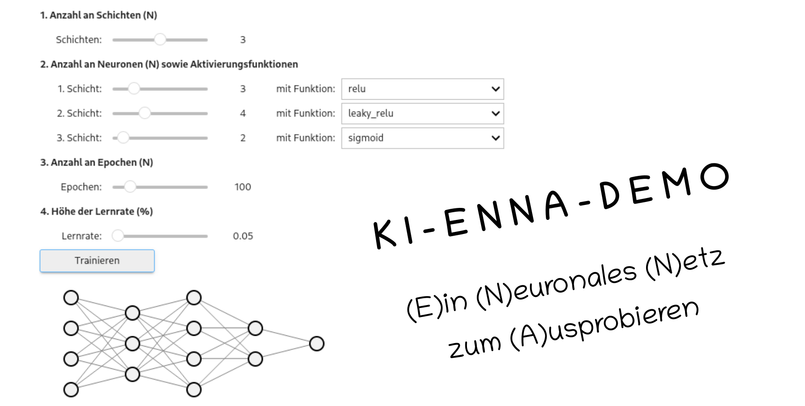
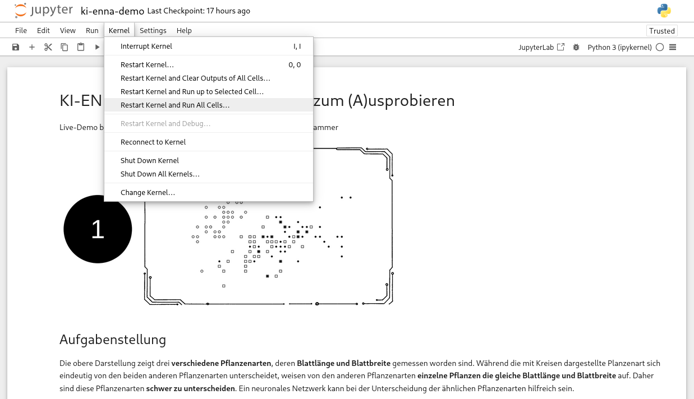

# KI-ENNA (DEMO)
Dies ist eine Demo von KI-ENNA, (E)inem (N)euronalen (N)etz zum (A)usprobieren. Die Demo verwendet den IRIS Datensatz, um den Einsatz eines neuronalen Netzwerkes für eine Klassifikationsaufgabe zu demonstrieren.

# Author
Prof. Dr. habil. Dennis Klinkhammer

# Anleitung
Das Jupyter Notebook (*.ipynb*) einfach über einen Doppelklick aufrufen und alle Zellen ausführen lassen (*Restart Kernel and Run All Cells...*), fertig!

